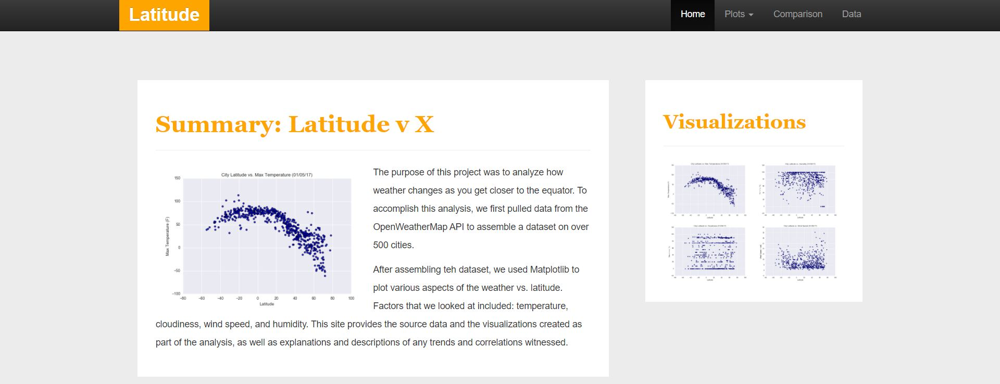

# webdev-bootstrap 

Author:  Erin James Wills, ejw.data@gmail.com  

<cite>Photo by Erin Wills</cite>

## Overview

Example of the use of the Bootstrap Framework (v4) using images that were created in Python from an earlier [data analysis](https://github.com/ejw-data/pandas-weather-analysis).  The goal of the task was to create templates and generate pages with minimal time usage.

## Bootstrap Features:
* Responsive Menu
* Responsive Layout
* Responsive Table
* CSS Hover Effects

## Github Pages  

https://ejw-data.github.io/webdev-bootstrap/
   

 

## Technologies    
*  HTML/CSS/JS
*  Bootstrap4

 

## Data Source  

Not applicable

 

## Setup and Installation  

1. Clone the repo to your local machine
1. Open repo folder in an IDE like VSCode
1. Using a virtual server like the VSCode extention LiveServer
1. Run `index.html`  

 

## Example

 
    
### Meta
    Credits:  Developed by Erin Wills
    License:  None
    Contributors:  None 